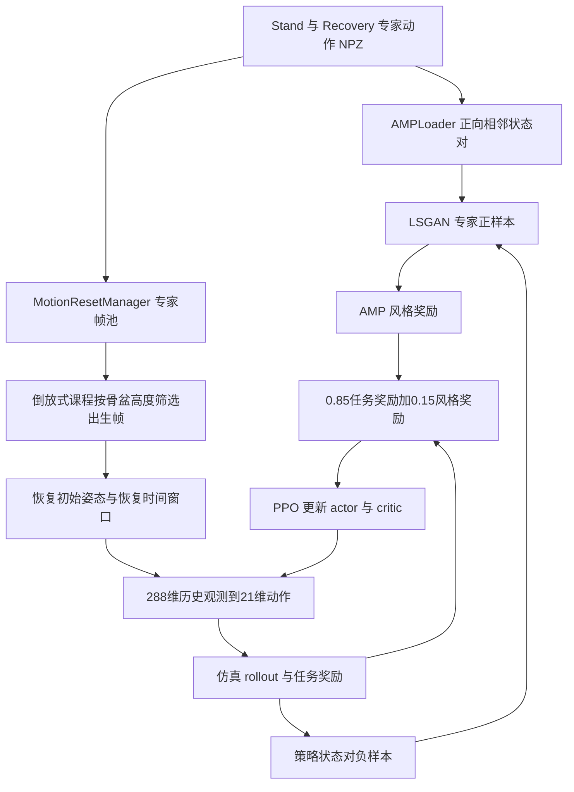
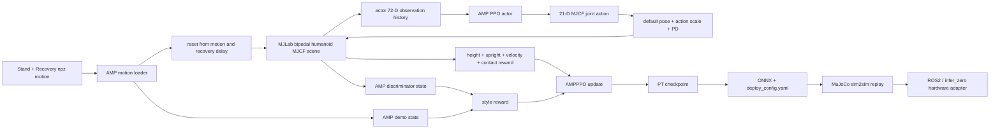
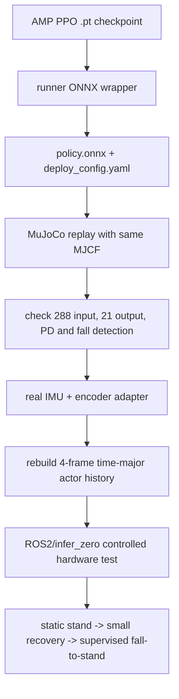

<p align='center'><a href='#zh'>中文</a> | <a href='#en'>English</a></p>
<a id='zh'></a>

# 跌倒起身训练架构（AMP + 专家指导 + 倒放式课程）

## 训练权重如何理解 / Interpreting training weights

本文按本仓库当前代码说明训练机制；已有策略的复现参数以对应 run 的 `params/env.yaml`、`params/agent.yaml` 和部署配置为准。奖励混合系数、逐项环境奖励权重、优化器 loss 系数、专家样本比例以及课程采样范围是不同概念。

混合系数可以写成 85%/15% 这样的配置比例，但不能代表训练过程中实际累计奖励贡献；单项 reward 的数值范围、门控、控制步长和出现频率都不同。需要实际贡献占比时，应统计同一 run 中每项加权回报，而不是把配置权重归一化成百分比。

Configuration mixing coefficients are not measured reward contributions. Environment weights, optimizer coefficients, expert sampling and curriculum schedules describe different parts of training. Reproduce a saved policy with its own run snapshots.

## AMP、专家指导与倒放式课程的实际训练流程

框架为 **AMP + 专家动作指导 + 倒放式课程，使用 PPO 优化控制策略**。专家指导通过专家动作状态转移训练判别器，并通过专家姿态初始化环境；当前 GetUp 注册使用 `AMPPPO`，没有启用独立的 teacher-action 行为克隆或蒸馏 loss。



### 奖励混合与 loss 系数

```text
phi(D) = max(0, 1 - 0.25 * (D(s_t, s_next) - 1)^2)
r_AMP = 0.1 * phi(D)
r_PPO = 0.85 * r_task + 0.15 * r_AMP
      = 0.85 * r_task + 0.015 * phi(D)

L_disc = 0.5 * MSE(D(expert), +1) + 0.5 * MSE(D(policy), -1)
L_grad = 10 * E[||gradient D(expert transition)||^2]
L_total = L_PPO_clip + 1.0 * L_value - 0.005 * entropy
        + 1.0 * L_disc + 1.0 * L_grad
```

| 层次 | 当前系数/参数 | 准确含义 |
|---|---|---|
| 任务/AMP 混合 | `0.85 / 0.15` | 85% 与 15% 是混合系数 |
| AMP 风格强度 | `amp_reward_coef=0.1` | 在混合之前缩放风格分数，混合后系数为 0.015 |
| 判别器分类损失 | 专家/策略各 `0.5` | 两类 MSE 的系数，和 Stand/Recovery 数据比例无关 |
| 梯度惩罚 | `lambda_=10` | 约束判别器输入梯度 |
| PPO value / entropy | `1.0 / 0.005` | value loss 和探索熵的系数 |
| 优化 | Adam、初始 LR `1e-3`、adaptive、5 epochs、4 mini-batches | actor/critic 与 discriminator 参数在 AMPPPO optimizer 中更新 |
| 恢复环境比例 | `delay_reset_env_ratio=1.0` | 当前所有环境按恢复环境初始化，不是 AMP 奖励占比 |
| 恢复时间窗口 | `300` 策略步 | 100 Hz 下约 3 s，延迟失败重置 |

`r_task` 是 RewardManager 输出；下方逐项权重表描述其内部构成。`track_anchor_linear_velocity`、`track_anchor_angular_velocity` 与 `body_ang_vel_xy_l2` 在恢复延迟窗口内受 mask 限制，当前 delay reward ratio 为 0。名称含 `l2` 的 `body_ang_vel_xy_l2` 实际返回指数稳定奖励，所以其 `+0.5` 是正奖励。站高 `root_height_progress` 为目标站高处取峰值的高斯函数，低于目标时随接近目标而增大，超过目标后下降。

### 专家指导如何采样

`AMPLoader` 递归读取 `amp_motion_files` 中的 NPZ，以 `batch_idx % num_motions` 轮换动作文件，再随机选取文件内帧与下一帧。每次 generator 调用从 batch 0 开始，因此有限批次下不应声称每个文件严格等概率，更不存在固定 Stand:Recovery=50:50。专家转移仍按正向时间 `(s_t, s_{t+1})` 读取。

专家特征为 11 个跟踪刚体的位置 3、旋转 6、线速度 3、角速度 3，共 `11×15=165` 维；判别器拼接相邻状态为 `330` 维。它们与部署 actor 的 `4×72=288` 维输入不同。reset 帧池按骨盆高度筛选并随机抽帧，将 root/joint 状态写入仿真，从而提供专家状态指导。

### 倒放式课程：从起身末段向更早姿态扩展

```text
progress = min(1, common_step_counter / anneal_steps)
z_lower = z_from + (z_to - z_from) * progress
Recovery 出生候选 = {frame | z_lower <= pelvis_z <= z_cap}
```

| 参数 | 课程函数默认值 | 当前 env_cfgs.py 与 v2/model_72500 快照 |
|---|---|---|
| `z_from` | `0.44 m` | `0.16 m` |
| `z_to` | `0.16 m` | `0.16 m` |
| `z_cap` | `0.63 m` | `0.63 m` |
| `anneal_steps` | `400000` | `400000`，起止值相同时不产生退火 |

课程函数默认先从接近站立的姿态开始，再降低出生高度下界，让策略逐步学会更早、更低的恢复阶段；这是 backward chaining，并不是把专家动作倒序播放。当前发布配置和 v2 策略快照已直接使用 `[0.16,0.63] m`，处于完全放开的恢复采样范围。候选帧少于 8 时，代码回退到全帧池。`400000` 是全局策略步数，不是 PPO iteration 数。

训练复现顺序：准备 Stand/Recovery 专家 NPZ → 核对刚体和关节映射 → 选择出生高度范围 → 用专家姿态 reset → 采集策略 rollout → 判别器比较专家与策略转移 → 混合 task/AMP 奖励 → PPO 更新 → 保存 env/agent 快照和 checkpoint → 导出 actor。若要从易到难重新启用课程，需要在当前环境配置中明确使用不同的 `z_from/z_to`；只运行当前默认入口会直接从完全放开的范围开始。

源码依据（仓库根目录下）：`framework/amp_mjlab/AMP_mjlab/src/tasks/amp_loco/config/lens110/{env_cfgs,events,rl_cfg}.py`、`rsl_rl/modules/discriminator.py`、`rsl_rl/algorithms/amp_ppo.py`、`rsl_rl/utils/motion_loader.py`（后三者位于同一 AMP_mjlab 框架目录）；已保存策略依据为 `exports/versions/Lens110_GetUp_Sim2Real_v2_20260908/policy/params/{env,agent}.yaml`。

### English — expert guidance, curriculum and coefficients

GetUp combines AMP, expert-motion guidance and backward-chaining reset curriculum, optimized with PPO. Experts train the discriminator on forward adjacent state pairs and initialize simulator states; the registered AMPPPO task does not enable a separate action-cloning/teacher-distillation loss. The exact reward is `0.85*r_task + 0.15*(0.1*phi(D))`. Discriminator expert/policy MSE terms each have coefficient 0.5; gradient penalty is 10, value coefficient 1.0 and entropy coefficient 0.005. These numbers are not measured contribution percentages.

The curriculum function defaults to lowering the birth-height threshold from 0.44 to 0.16 m over 400000 global policy steps, with upper bound 0.63 m. Current source and the v2/model_72500 snapshot both set start=end=0.16 m, so they use the fully expanded recovery range from the start. All environments are recovery environments (`1.0`), with a 300-step/3-second recovery window. Expert clips are selected by batch-index cycling, then frames are sampled within a clip; there is no configured 50:50 Stand/Recovery split. Discriminator state/pair dimensions are 165/330, distinct from the 288-dimensional actor input.

## 1. 项目定位

本项目是双足人形机器人的“倒地后自动起身”训练链路，不是普通行走或舞蹈策略。训练使用 AMP + PPO：Stand motion 提供站立基准分布，Recovery motion 提供倒地/恢复片段，任务奖励沿着“倒地 → 躯干转直 → 骨盆升高 → 双脚站稳”的路径提供单调梯度。

| 项目项 | 当前配置 |
|---|---|
| task | `Lens110-AMP-GetUp` |
| 框架 | `framework/amp_mjlab/AMP_mjlab` |
| 算法 | `AMPPPO` + AMP discriminator |
| actor observation | 每帧 `72`，4 帧 time-major history 为 `288` |
| action | `21`，MJCF 顺序 |
| physics / policy | `500 Hz / 100 Hz`，`timestep=0.002`，`decimation=5` |
| episode | 训练 `20 s`；PLAY 为长时回放 |
| motion source | `assets/motions/lens110/Stand`、`Recovery` |
| 当前部署包 | `exports/versions/Lens110_GetUp_Sim2Real_v2_20260908` |

## 2. 原理

起身策略同时优化三类信号：

1. 任务奖励：零速度/零角速度目标、站高、躯干直立、脚底稳定、限位和动作平滑，给出可解释的起身路径梯度。
2. AMP 风格奖励：discriminator 比较机器人刚体状态序列与 Stand/Recovery demo，使恢复动作保持在参考运动分布附近。
3. 终止与 reset 课程：通过恢复延迟窗口允许低姿态探索，使用专家帧高度窗口初始化；当前起止下界相同，属于课程完全放开阶段，参数和公式见下文。

速度指令被固定为零，所以“站着不动”就是任务目标。部署时不需要 motion file 或参考动作，只需用当前 actor 观测运行 21 维 policy。

## 3. 总体流程图



## 4. 训练框架构成

| 层 | 实现 | 作用 |
|---|---|---|
| Scene | MJLab ManagerBased RL、双足人形机器人 MJCF、plane terrain | 倒地接触、碰撞和动力学 |
| Motion loader | Stand/Recovery npz，`MotionLoader` | 提供 AMP demo 和 reset 状态 |
| Actor obs | IMU、重力、零 command、关节状态、上一动作 | 形成部署一致的 actor 输入 |
| Critic obs | actor 观测 + base linear velocity、刚体位置/姿态等特权信息 | 只用于 value 估计 |
| AMP obs | 11 个 tracked bodies 的位置、姿态、线速度、角速度 | discriminator 的 style state |
| Reward manager | 起身进度、站立姿态、滑步、脚底、自碰撞、平滑和限位 | 形成 task reward |
| Termination manager | 70° 姿态、0.44 m 高度、time out | 识别失败/结束 |
| AMPPPO | PPO actor-critic + discriminator | 同时更新策略和风格判别器 |
| Export | `runner.py` ONNX wrapper + deploy config | 固化 raw observation 推理接口 |

AMP runner 配置为 `amp_reward_coef=0.1`、`amp_task_reward_lerp=0.85`、discriminator hidden dims `[1024,512,256]`、保留参数 `amp_num_preload_transitions=200000`（当前 AMPLoader 调用未消费它，不等于实际预载固定数量）。PPO 使用 clipped value、`clip_param=0.2`、`gamma=0.99`、`lam=0.95`、5 epochs、4 mini-batches。

## 5. Observation 函数和维度

### 5.1 Actor 输入

| Observation term | 维度 | 来源和含义 |
|---|---:|---|
| `base_ang_vel` | 3 | `robot/imu_ang_vel`，根/IMU 角速度 |
| `projected_gravity` | 3 | 机体系重力方向 |
| `command` | 3 | `twist` 速度指令；本任务恒为 `[0,0,0]` |
| `joint_pos_rel` | 21 | 相对默认关节位置 |
| `joint_vel_rel` | 21 | 相对关节速度 |
| `prev_actions` | 21 | 上一步 action |
| **每帧总计** | **72** | `3+3+3+21+21+21` |

actor observation group 配置 `history_length=4`、`history_ordering=time`，所以部署输入为 `4×72=288`，时间顺序不能倒置。起身任务已经删除 terrain height scan；真实部署不需要 motion file。

### 5.2 Critic 和 AMP observation

- critic 复用 actor terms，并加真实 `base_lin_vel`、以及 tracked bodies 的 `body_pos_b`、`body_ori_b` 等特权状态。critic history 默认也是 4；这些仿真真值不进入硬件 actor。
- AMP 当前状态和 demo 状态使用 `body_pos_b`、`body_ori_b`、`body_lin_vel_b`、`body_ang_vel_b`。双足人形机器人的 11 个 tracked bodies 为 pelvis、左右髋/膝/踝刚体、左右肩/肘刚体；anchor 为 `torso_yaw_link`。
- motion 文件保存 root/body 的位置、四元数、线速度、角速度以及 21 个 joint position/velocity；这是训练和 discriminator 的数据，不是 ONNX actor 的输入。

## 6. Action 和部署顺序

动作配置是 `JointPositionActionCfg`，使用默认位置偏置：

```text
q_des[i] = default_joint_pos_rad[i] + action_scale[i] * action[i]
action_dim = 21
clip_actions = None
```

策略向量使用 MJCF 顺序：

| 序号 | 关节 | 序号 | 关节 |
|---:|---|---:|---|
| 0 | left_hip_pitch_joint | 11 | right_ankle_roll_joint |
| 1 | left_hip_roll_joint | 12 | torso_yaw_joint |
| 2 | left_hip_yaw_joint | 13 | right_shoulder_pitch_joint |
| 3 | left_knee_joint | 14 | right_shoulder_roll_joint |
| 4 | left_ankle_pitch_joint | 15 | right_shoulder_yaw_joint |
| 5 | left_ankle_roll_joint | 16 | right_elbow_joint |
| 6 | right_hip_pitch_joint | 17 | left_shoulder_pitch_joint |
| 7 | right_hip_roll_joint | 18 | left_shoulder_roll_joint |
| 8 | right_hip_yaw_joint | 19 | left_shoulder_yaw_joint |
| 9 | right_knee_joint | 20 | left_elbow_joint |
| 10 | right_ankle_pitch_joint | | |

实机 SDK 的数组顺序不同，`deploy_config.yaml` 中的 `real_robot_mapping.joint_order` 是适配真机的置换；policy 向量仍保持 MJCF 顺序。动作 scale、PD、effort limit、joint direction 和 ankle upper/lower name map 必须成套使用。

## 7. Reward 函数由什么构成

起身奖励不是“越高越好”这一项单独决定，而是任务进度、躯干方向、站定质量和安全代价的组合。环境奖励为各 `RewardTermCfg` 乘权重求和；AMP style reward 由 discriminator 另行产生。

| 类别 | Reward term | 权重 | 作用 |
|---|---|---:|---|
| 速度 | `track_anchor_linear_velocity` | `+1.0` | 跟踪零线速度 |
| 角速度 | `track_anchor_angular_velocity` | `+1.0` | 跟踪零角速度 |
| 起身进度 | `track_root_height` / `root_height_progress` | `+5.0` | 骨盆低于目标时接近目标得分增加，超过目标后得分下降 |
| 姿态 | `torso_upright` | `+2.0` | 要求 `torso_yaw_link` 直立，避免只抬骨盆不立躯干 |
| 稳定 | `body_ang_vel_xy_l2` | `+0.5` | 抑制 pelvis 横向滚转/俯仰角速度 |
| 终止 | `is_terminated` | `-200.0` | 摔倒/失败的强惩罚 |
| 动力学 | `joint_acc_l2` | `-2.5e-7` | 抑制高频加速度 |
| 限位 | `joint_pos_limits` | `-10.0` | 远离关节限位 |
| 平滑 | `action_rate_l2` | `-0.01` | 抑制动作跳变 |
| 站定 | `foot_slip_stand` | `-2.0` | 接触地面时惩罚脚底水平滑动，不依赖速度指令 |
| 防跳 | `over_height_air` | `-20.0` | 骨盆超过目标站高加 margin 时惩罚腾空捷径 |
| 脚底 | `feet_sole_flat` | `+0.6` | 只在接近站高、速度小、双脚接触三重门同时满足时鼓励脚掌放平 |
| 安全 | `self_collisions` | `-0.1` | 惩罚自碰撞 |
| 风格 | AMP discriminator | `amp_reward_coef=0.1` | 让状态序列接近 Stand/Recovery demo |

脚底平整奖励的三重门为：骨盆接近站高 `gate_std=0.025`、根部水平速度低于 `0.25 m/s`、左右脚都接触地面；任一门关闭时该项为零，避免恢复过程中的踝部翻转被过早锁死。训练中的 `foot_slip` 默认项因零速度 command 会失效，本配置改用与 command 无关的 `foot_slip_stand`。

终止条件包括 time out、姿态超过 `70°`、骨盆低于 `0.44 m`；恢复延迟窗口会暂缓失败重置。当前出生高度窗口固定为 `[0.16,0.63] m`，候选不足时回退全帧池。

## 8. 训练、导出和目录

```text
data/motions/walk0821/                 # 原始/修复后的跌倒动作资料
data/training/amp_lens110_motions/     # Stand/Recovery 训练 motion
experiments/runs/                      # TensorBoard、checkpoint、配置快照
exports/versions/                      # v1/v2/repro 导出版本
framework/amp_mjlab/AMP_mjlab/         # 训练、AMP、MJLab、WBC/FSM 代码
docs/REWARD_STRUCTURE.md                # 奖励结构证据
docs/                                  # 奖励证据和复现记录
```

训练入口：

```bash
./scripts/train.sh --env.scene.num-envs=2048
```

## 9. 导出、MuJoCo 和真机



v2 `deploy_config.yaml` 是部署真值，包含 physics/policy frequency、288 history、21 joint names、default pose、action scale、PD、effort limit、fall height/tilt、SDK joint order 和 `deploy_entry`。导出的 ONNX wrapper 包含 observation normalizer 时，C++/ROS2 侧必须直接提供 raw observation，不要重复归一化。

## 10. 复现验收清单

- [ ] Stand/Recovery motion loader 能加载且 anchor/body names 与双足人形机器人 MJCF 一致。
- [ ] actor 为 72/288，action 为 21，历史为 time-major。
- [ ] command 恒为零，部署不依赖 motion file。
- [ ] 训练 task reward、AMP style reward、PPO loss 和终止统计分开记录。
- [ ] action scale、default pose、PD、effort limit、joint direction 与 deploy YAML 一致。
- [ ] MuJoCo 回放完整，且倒地接触不会触发错误的普通 locomotion 终止。
- [ ] 真机测试有急停、低增益、限位、电流/温度监控和人工看护。

## 项目演示


GIF 是 README 直接展示的演示片段；原始 MP4 保留在 `docs/media/fall-to-stand-demo.mp4` 供下载和复核。

<a id='en'></a>

# Fall-to-Stand Training Architecture (AMP + Expert Guidance + Backward Curriculum)

## Scope

This repository trains fall-to-stand behavior for a bipedal humanoid robot with AMP and PPO. Stand and Recovery motion sets provide the reference distribution, while task rewards shape the path from a fallen pose to an upright, stable stance. The policy observes 72 values per frame and a four-frame time-major history of 288 values, then outputs 21 MJCF-order joint-position actions.

The velocity command is always zero: standing still is the task. AMP uses `amp_reward_coef=0.1`, `amp_task_reward_lerp=0.85`, a discriminator with hidden layers `[1024,512,256]`, and `AMPPPO`. The discriminator uses its own tracked-body state sequence and is not part of the hardware actor input.

## Observation and action

The actor terms are 3 IMU angular-velocity values, 3 projected-gravity values, 3 zero command values, 21 relative joint positions, 21 relative joint velocities, and 21 previous actions. Four time-ordered frames produce 288 values. The critic adds privileged base linear velocity and tracked-body features. AMP uses body position, orientation, linear velocity, and angular velocity for 11 tracked bodies anchored at `torso_yaw_link`.

The action is `default_joint_pos + action_scale * action` with 21 entries in MJCF order. The hardware SDK uses a different permutation; `real_robot_mapping.joint_order` in `deploy_config.yaml` is authoritative. Do not reorder the policy vector itself.

## Reward

The task reward includes zero linear/angular velocity tracking (`+1/+1`), target-height Gaussian reward (`+5`), torso upright (`+2`), body angular-rate stability (`+0.5`), termination (`-200`), joint acceleration (`-2.5e-7`), joint limits (`-10`), action rate (`-0.01`), command-independent standing foot slip (`-2`), over-height/airborne penalty (`-20`), gated flat soles (`+0.6`), and self-collision (`-0.1`). The flat-sole term requires near target height, low horizontal speed, and both feet in contact. AMP discriminator style reward is an algorithm-level term scaled by `0.1`.

Failure gates include orientation, base height and timeout, subject to the recovery delay window. Current reset bounds are fixed at [0.16, 0.63] m; the backward curriculum can progressively lower the bound when start and end differ.

## Reproduction and deployment

Run `./scripts/train.sh --env.scene.num-envs=2048` with the local AMP/MJLab environment. Export the actor with the local ONNX wrapper and keep `deploy_config.yaml`, default pose, scales, PD, effort limits, SDK joint permutation, and fall detection thresholds together. Replay with the same MJCF in MuJoCo, then rebuild the 72-dimensional actor terms and four-frame history from real IMU/encoders before staged hardware testing. The deployed actor does not need a motion file.
