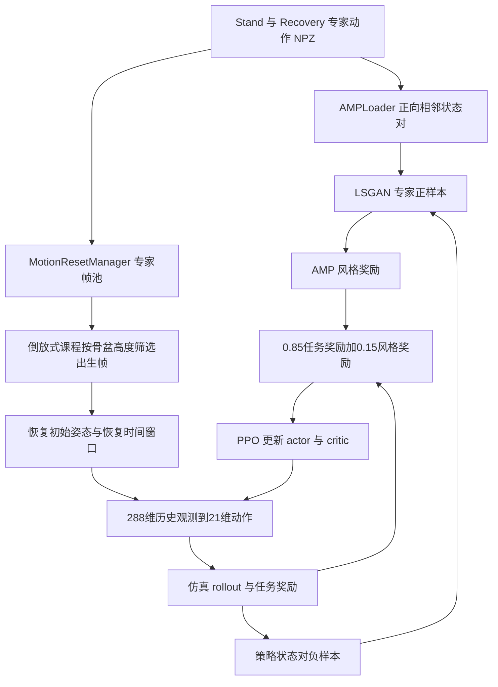

# 跌倒起身 AMP 奖励结构

起身任务使用零速度/零角速度目标、`track_root_height=+5.0`、`torso_upright=+2.0`、终止惩罚、关节限位、
动作平滑、自碰撞和恢复专用的 `foot_slip_stand=-2.0`、`over_height_air=-20.0`、
`feet_sole_flat=+0.6`。脚底平整项由站高、水平速度和双脚接触三重门控，避免恢复途中锁死踝关节。

站立/恢复 motion 由 AMP discriminator 同时约束；实现文件是
`framework/amp_mjlab/AMP_mjlab/src/tasks/amp_loco/config/lens110/env_cfgs.py` 和同目录 `rewards.py`。
完整权重表见 [`docs/REWARD_FRAMEWORKS.md`](../../../docs/REWARD_FRAMEWORKS.md)。

## 训练权重如何理解 / Interpreting training weights

本文按本仓库当前代码说明训练机制；已有策略的复现参数以对应 run 的 `params/env.yaml`、`params/agent.yaml` 和部署配置为准。奖励混合系数、逐项环境奖励权重、优化器 loss 系数、专家样本比例以及课程采样范围是不同概念。

混合系数可以写成 85%/15% 这样的配置比例，但不能代表训练过程中实际累计奖励贡献；单项 reward 的数值范围、门控、控制步长和出现频率都不同。需要实际贡献占比时，应统计同一 run 中每项加权回报，而不是把配置权重归一化成百分比。

Configuration mixing coefficients are not measured reward contributions. Environment weights, optimizer coefficients, expert sampling and curriculum schedules describe different parts of training. Reproduce a saved policy with its own run snapshots.

## AMP、专家指导与倒放式课程的实际训练流程

框架为 **AMP + 专家动作指导 + 倒放式课程，使用 PPO 优化控制策略**。专家指导通过专家动作状态转移训练判别器，并通过专家姿态初始化环境；当前 GetUp 注册使用 `AMPPPO`，没有启用独立的 teacher-action 行为克隆或蒸馏 loss。



### 奖励混合与 loss 系数

```text
phi(D) = max(0, 1 - 0.25 * (D(s_t, s_next) - 1)^2)
r_AMP = 0.1 * phi(D)
r_PPO = 0.85 * r_task + 0.15 * r_AMP
      = 0.85 * r_task + 0.015 * phi(D)

L_disc = 0.5 * MSE(D(expert), +1) + 0.5 * MSE(D(policy), -1)
L_grad = 10 * E[||gradient D(expert transition)||^2]
L_total = L_PPO_clip + 1.0 * L_value - 0.005 * entropy
        + 1.0 * L_disc + 1.0 * L_grad
```

| 层次 | 当前系数/参数 | 准确含义 |
|---|---|---|
| 任务/AMP 混合 | `0.85 / 0.15` | 85% 与 15% 是混合系数 |
| AMP 风格强度 | `amp_reward_coef=0.1` | 在混合之前缩放风格分数，混合后系数为 0.015 |
| 判别器分类损失 | 专家/策略各 `0.5` | 两类 MSE 的系数，和 Stand/Recovery 数据比例无关 |
| 梯度惩罚 | `lambda_=10` | 约束判别器输入梯度 |
| PPO value / entropy | `1.0 / 0.005` | value loss 和探索熵的系数 |
| 优化 | Adam、初始 LR `1e-3`、adaptive、5 epochs、4 mini-batches | actor/critic 与 discriminator 参数在 AMPPPO optimizer 中更新 |
| 恢复环境比例 | `delay_reset_env_ratio=1.0` | 当前所有环境按恢复环境初始化，不是 AMP 奖励占比 |
| 恢复时间窗口 | `300` 策略步 | 100 Hz 下约 3 s，延迟失败重置 |

`r_task` 是 RewardManager 输出；下方逐项权重表描述其内部构成。`track_anchor_linear_velocity`、`track_anchor_angular_velocity` 与 `body_ang_vel_xy_l2` 在恢复延迟窗口内受 mask 限制，当前 delay reward ratio 为 0。名称含 `l2` 的 `body_ang_vel_xy_l2` 实际返回指数稳定奖励，所以其 `+0.5` 是正奖励。站高 `root_height_progress` 为目标站高处取峰值的高斯函数，低于目标时随接近目标而增大，超过目标后下降。

### 专家指导如何采样

`AMPLoader` 递归读取 `amp_motion_files` 中的 NPZ，以 `batch_idx % num_motions` 轮换动作文件，再随机选取文件内帧与下一帧。每次 generator 调用从 batch 0 开始，因此有限批次下不应声称每个文件严格等概率，更不存在固定 Stand:Recovery=50:50。专家转移仍按正向时间 `(s_t, s_{t+1})` 读取。

专家特征为 11 个跟踪刚体的位置 3、旋转 6、线速度 3、角速度 3，共 `11×15=165` 维；判别器拼接相邻状态为 `330` 维。它们与部署 actor 的 `4×72=288` 维输入不同。reset 帧池按骨盆高度筛选并随机抽帧，将 root/joint 状态写入仿真，从而提供专家状态指导。

### 倒放式课程：从起身末段向更早姿态扩展

```text
progress = min(1, common_step_counter / anneal_steps)
z_lower = z_from + (z_to - z_from) * progress
Recovery 出生候选 = {frame | z_lower <= pelvis_z <= z_cap}
```

| 参数 | 课程函数默认值 | 当前 env_cfgs.py 与 v2/model_72500 快照 |
|---|---|---|
| `z_from` | `0.44 m` | `0.16 m` |
| `z_to` | `0.16 m` | `0.16 m` |
| `z_cap` | `0.63 m` | `0.63 m` |
| `anneal_steps` | `400000` | `400000`，起止值相同时不产生退火 |

课程函数默认先从接近站立的姿态开始，再降低出生高度下界，让策略逐步学会更早、更低的恢复阶段；这是 backward chaining，并不是把专家动作倒序播放。当前发布配置和 v2 策略快照已直接使用 `[0.16,0.63] m`，处于完全放开的恢复采样范围。候选帧少于 8 时，代码回退到全帧池。`400000` 是全局策略步数，不是 PPO iteration 数。

训练复现顺序：准备 Stand/Recovery 专家 NPZ → 核对刚体和关节映射 → 选择出生高度范围 → 用专家姿态 reset → 采集策略 rollout → 判别器比较专家与策略转移 → 混合 task/AMP 奖励 → PPO 更新 → 保存 env/agent 快照和 checkpoint → 导出 actor。若要从易到难重新启用课程，需要在当前环境配置中明确使用不同的 `z_from/z_to`；只运行当前默认入口会直接从完全放开的范围开始。

源码依据（仓库根目录下）：`framework/amp_mjlab/AMP_mjlab/src/tasks/amp_loco/config/lens110/{env_cfgs,events,rl_cfg}.py`、`rsl_rl/modules/discriminator.py`、`rsl_rl/algorithms/amp_ppo.py`、`rsl_rl/utils/motion_loader.py`（后三者位于同一 AMP_mjlab 框架目录）；已保存策略依据为 `exports/versions/Lens110_GetUp_Sim2Real_v2_20260908/policy/params/{env,agent}.yaml`。

### English — expert guidance, curriculum and coefficients

GetUp combines AMP, expert-motion guidance and backward-chaining reset curriculum, optimized with PPO. Experts train the discriminator on forward adjacent state pairs and initialize simulator states; the registered AMPPPO task does not enable a separate action-cloning/teacher-distillation loss. The exact reward is `0.85*r_task + 0.15*(0.1*phi(D))`. Discriminator expert/policy MSE terms each have coefficient 0.5; gradient penalty is 10, value coefficient 1.0 and entropy coefficient 0.005. These numbers are not measured contribution percentages.

The curriculum function defaults to lowering the birth-height threshold from 0.44 to 0.16 m over 400000 global policy steps, with upper bound 0.63 m. Current source and the v2/model_72500 snapshot both set start=end=0.16 m, so they use the fully expanded recovery range from the start. All environments are recovery environments (`1.0`), with a 300-step/3-second recovery window. Expert clips are selected by batch-index cycling, then frames are sampled within a clip; there is no configured 50:50 Stand/Recovery split. Discriminator state/pair dimensions are 165/330, distinct from the 288-dimensional actor input.
